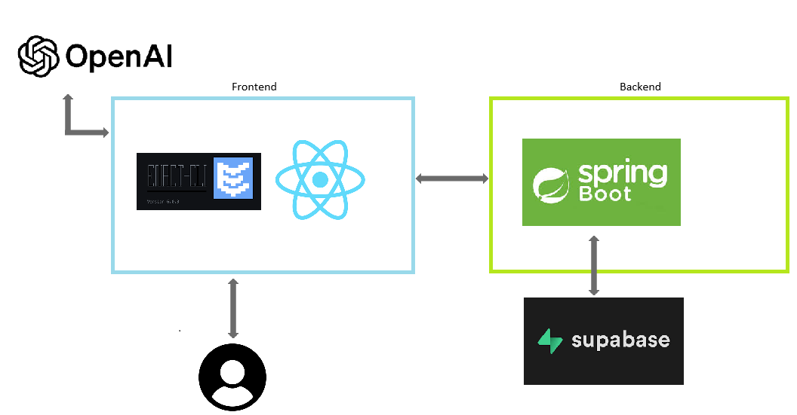

# Media Web Application Backend의 시청 서비스 요구사항 명세서

## 1. 문서 설명(Document Description)

### 1.1. 목적(Purpose)
본 문서는 웹OS 기반의 미디어 컨텐츠 재생과 기타 추가 기능을 구현하는 클라이언트 프로그램의 요구사항과 기술적 특성을 포함한다.

### 1.2. 범위(Scope)
이 문서에는 아래의 요구 사항이 포함되어 있다.

- 데이터베이스의 미디어 컨텐츠 재생
- 사용자 구분을 통한 재생 목록 제공
- 시스템 상태 정보(예: CPU, 메모리 사용량)를 모니터링
- 챗봇, 디테일, 댓글 등 의견 공유와 정보 수집을 위한 다양한 기능 제공
- 웹OS 기반의 스마트 TV에서 효과적으로 동작하는 사용자 인터페이스 구현

### 1.3. 용어 및 정의(Terminologies and Definitions)
- Enact: 대형 화면 기기를 위한 사용자 인터페이스 개발에 특화된 React 기반의 응용 프로그램 프레임워크이다. 성능 최적화, 접근성, 국제화를 포함한 다양한 기능을 갖추고 있으며, webOS 플랫폼과의 호환성에 중점을 둔다.
- Luna Service API: webOS TV에서 제공하는 핵심 서비스와 기능을 포함하는 API로, webOS 시스템 서비스와의 통신을 가능하게 해준다. Luna Service API를 통해 다양한 시스템 기능에 액세스하고, 사용자 정의 기능을 webOS에 통합할 수 있다.

## 2. 시스템 컨텍스트(System Context)
- 시스템은 우분투 환경을 기반으로, Frontend는 Enact Framework를 사용하여 UI를 구현하여 사용자와 소통한다. Backend는 Spring Boot로 시스템을 구축하고 Supabase를 이용하여 사용자와 미디어 데이터, 댓글, 재생목록 등을 관리한다. Frontend와 Backend는 REST API 규약에 따라 소통한다.

**FrontEnd**

Frontend의 주 기능은 사용자에게 미디어 재생과 기타 기능들을 지원하는 것이다. 재생 가능한 미디어의 목록을 사용자에게 제공하고 이어보기 기능을 지원하기 위해 미디어의 목록과 사용자의 재생 기록 정보를 요청하거나 사용자의 정보를 갱신하기 위해 backend와 상호작용한다. 그리고 재생목록 생성, 영상 추가 등 재생 목록 생성을 위해서도 backend와 상호작용한다. 부가적으로 사용자에게 기기의 시스템 자원 데이터 현황과 사용자의 프로그램 사용 경향을 시각적으로 제공한다.

**BackEnd**

Frontend에서 요청하는 정보를 제공하기 위한 서버이다. 사용자 정보와 미디어 정보를 데이터베이스에 저장하여 관리하는 주체이며, frontend의 데이터 생성 및 삭제, 수정, 전달 요청을 처리한다.

## 3. 요구사항(Requirements)

### 3.1. 기능 요구사항(functional Requirements)  

### Backend Server

#### 3.1.1. Client로부터 입력 받을 interface 제공
ID  | Requirement   |   API ID | Test Case ID
--- |   ---     |   --- | ---
FR01-1  |   client로부터 사용자 정보를 전달 받으면, backend 서버는 데이터베이스의 필드에 맞게 파싱한다. - 데이터베이스의 필드에는 다음 요소들이 포함되어야 한다 <ul> <li>id: 세션을 구분할 고유한 ID</li><li>username: 클라이언트의 이름</li><li>password: username으로 로그인할 때 사용할 비밀번호</li><li>userbirth: 클라이언트 생일</li></ul>     |   <li>BA01-1</li> | <li>TC01-1</li><li>TC01-2</li>
FR05-3  |   client로부터 추가할 영상과 대상 플레이리스트 정보를 전달 받으면, backend 서버는 필드에 맞게 파싱된 데이터를 데이터베이스에 저장한다. - 데이터베이스의 필드에는 다음 요소들이 포함되어야 한다 <ul> <li>videoId: 영상을 구분할 고유한 ID</li><li>playlistId: 플레이리스트를 구분할 고유한 ID</li></ul> |   <li>BA07-3</li> | <li>TC07-3</li><li>TC07-4</li><li>TC07-5</li>
FR05-4  |   client로부터 생성할 플레이리스트 정보를 전달 받으면, backend 서버는 필드에 맞게 파싱된 데이터를 데이터베이스에 저장한다. - 데이터베이스의 필드에는 다음 요소들이 포함되어야 한다 <ul> <li>userId: 유저를 구분할 고유한 ID</li><li>title: 플레이리스트의 이름</li></ul> |   <li>BA07-1</li>| <li>TC07-1</li>
FR06-1  |   client로부터 업로드할 영상 정보를 전달 받으면, backend 서버는 필드에 맞게 파싱된 데이터를 데이터베이스에 저장한다. - 데이터베이스의 필드에는 다음 요소들이 포함되어야 한다 <ul> <li>file: 영상 바이너리 파일</li><li>title: 영상 제목</li></ul> |   <li>BA05-1</li> | <li>TC05-1</li><li>TC05-2</li>

#### 3.1.2. 데이터베이스의 데이터 요청에 대한 처리
ID  | Requirement   | API ID | Test Case ID
--- |   ---     |   --- | ---
FR01-1  |   frontend 서버로부터 사용자 정보를 받으면, backend 서버는 데이터베이스에서 username이 중복되는지 확인하고 중복되지 않으면 데이터베이스에 사용자 정보를 저장한다. |   BA01-1  | TC01-1
FR02-1  |   frontend 서버로부터 사용자 정보를 받으면, backend 서버는 데이터베이스에서 사용자 정보 일치 여부를 확인한 후 frontend 서버로 일치여부를 전송한다. | BA02-1   |TC02-1
FR03-2  |   frontend 서버로부터 나열된 미디어의 ID를 받으면, backend 서버는 데이터베이스에 저장된 미디어 제목 데이터를 전송한다.  |   BA04-2    | TC04-3
FR04-1  |   frontend 서버로부터 특정 사용자의 시청한 영상 목록 정보 요청을 받으면, backend 서버는 데이터베이스에서 해당하는 사용자의 시청기록을 최근에 본 순서대로 처리하여 전송한다.  |   BA06-2  |TC06-3
FR05-1  |   frontend 서버로부터 특정 사용자의 재생 목록 정보 요청을 받으면, backend 서버는 데이터베이스에서 해당하는 사용자의 재생목록 정보를 전송한다.  |   BA07-2  |   TC07-2
FR05-2  |   frontend 서버로부터 특정 재생목록의 영상 목록 정보 요청을 받으면, backend 서버는 데이터베이스에서 해당하는 재생목록의 영상 목록을 전송한다.  |   BA07-4   | TC07-6
FR05-3  |   frontend 서버로부터 특정 재생목록에 영상 추가 요청을 받으면, backend 서버는 데이터베이스에서 해당 재생목록에 영상이 중복되는지 확인하고 중복되지 않는다면 해당 재생 목록 데이터베이스에 영상을 저장한다.  |   BA07-3   | TC07-4
FR05-4  |   frontend 서버로부터 재생 목록의 생성 요청을 받으면, backend 서버는 데이터베이스에 해당 재생 목록을 저장한다.  |   BA07-1   | TC07-1
FR06-1  |   frontend 서버로부터 영상 업로드 요청을 받으면, backend 서버는 데이터베이스에 영상 정보를 저장한다.  |   BA05-1   | TC05-1

----

### Frontend Server
#### 3.1.3. 회원 가입 및 로그인
1. `FR01`: 회원가입
    - `FR01-1`: 사용자가 회원가입 탭에 접근하면 사용자 정보(username, password)를 입력받고, UserID를 발급한다.
2. `FR02`: 로그인
    - `FR02-1`: 사용자가 로그인 탭에 접근하면 사용자 이메일과 password를 입력받고, backend의 데이터베이스에 등록되었는지 여부를 확인해 등록되어 있다면 로그인을 수행하고 Main 창으로 전환한다.

#### 3.1.4. 메인 화면 및 탭
1. `FR03`: 메인 화면 탭
    - `FR03-1`: 사용자가 로그인에 성공한 후 메인 화면으로 전환되면 재생 가능한 미디어 목록을 10개 씩 나열한다.
    - `FR03-2`: 나열된 미디어들은 썸네일 이미지, 제목의 정보가 같이 보이도록 한다.
    - `FR03-3`: 미디어 썸네일을 클릭하면 Video Player가 실행된다.
2. `FR04`: 최근 시청 영상 목록
    - `FR04-1`: 최근에 시청한 영상 목록을 보여준다
3. `FR05`: 재생 목록 탭
    - `FR05-1`: 사용자 소유의 재생 목록 리스트가 출력된다
    - `FR05-2`: 리스트를 선택하면 팝업 창으로 영상 리스트가 보여진다.
    - `FR05-3`: 영상을 추가하고 싶다면 Add 버튼을 누른다. 버튼을 누르면 팝업 창이 전환되고, 전환된 팝업 창에 뜬 영상을 클릭 한 후 Add 버튼을 누르면 영상이 재생 목록에 추가된다.
    - `FR05-4`: 재생 목록을 추가하고 싶다면 Create New Playlist 버튼을 눌러 새 재생목록을 구현할 수 있다.
4. `FR06`: 영상 추가
    - `FR06-1`: 버튼을 누르면 영상을 추가할 수 있는 QR 코드가 생성된다. 이를 통해 영상 업로드를 휴대폰으로 진행 가능하다.
5. `FR07`: 상태 창
    - `FR07-1`: 기본적으로 메모리와 cpu 사용량에 대한 막대 그래프가 출력된다.
    - `FR07-2`: 하단 버튼을 누르면 상세한 메모리, CPU 사용량을 체크할 수 있다.
    - `FR07-3`: TV 정보를 하단 버튼을 통해서 접근할 수 있다.
6. `FR08`: 로그아웃
    - `FR08-1`: 로그아웃 버튼을 통해 로그아웃 할 수 있다.

#### 3.1.5. 비디오 플레이어 내부 기능
1. `FR09`: 챗봇 기능
    - `FR09-1`: 챗봇 버튼을 통해 챗봇 대화 팝업 창으로 전환 가능하고, 이를 통해 챗봇과 대화가 가능하다.
2. `FR10`: 댓글 기능
    - `FR10-1`: 댓글 버튼을 통해 댓글 팝업 창으로 진입 가능하다.
    - `FR10-2`: 댓글 창에 입력 후 전송 버튼 클릭 시 서버로 댓글 전송이 가능하다.

### 3.2. 품질 요구사항(Quality Attribute)
1. `QA01`: 사용자가 이전에 재생한 기록이 있는 미디어를 다시 재생시킬 경우, 미디어 재생 기록을 DB에서 받아와 정확한 위치에서 미디어를 재생시킬 수 있다.

### 3.3 제약 사항 (**Constraint Requirement)**

1. `CR01`: 서버와 프레임워크는 Spring Boot를 기반으로 사용한다.
2. `CR02`: Frontend는 Enact Framework를 기반으로 한다.
3. `CR03`: 데이터베이스는 Supabase를 사용한다.
4. `CR04`: 백엔드 배포는 로컬 서버를 통해 진행한다. 

# 4. Architecture Overview

## 4.1 **Static Perspective**

### 4.1.1 Frontend architecture

- `FR01`: Login Component
    - handleLogin() : 로그인을 위해 입력된 유저 이름과 비밀번호를 서버로 전송하고 유효 여부를 반환 받는다.
- `FR02`: SignUp component
    - handleSignUp() : 회원 가입을 위해 입력된 유저 이름과 비밀번호를 서버로 전송하고 유효 여부를 반환 받는다.
- `FR03`: Logout component
    - handleLogOut() : 로그아웃 버튼이 눌린 즉시 캐시된 유저 이름과 비밀번호를 초기화하고 로그인 창으로 전환한다.
- `FR04`: Main component
    - generateVideoData() : 영상에 대한 제목, 썸네일, 소스 등을 재귀적으로 요청하여 영상 데이터를 저장한다.
    - loadData() : generateVideoData()를 통해 받은 영상 정보를 기반으로 메인 창에 10개씩 띄운다.
- `FR05`: Video Player component
    - handleVideoEnd() : 현재 영상에 대해서 나갈 때 시청 중이던 영상의 재생 시각을 저장한다.
    - handleLoadedData() : 선택된 영상에 대해서 재생 기록을 가져와 로드한다.
    - handleSendMessage() : 챗봇 기능을 위해 입력된 질문을 OpenAI API를 활용하여 질의하고, 응답을 받는다.
    - fetchComments() : 데이터베이스에 저장된 영상에 대한 댓글을 가져온다.
    - postComments() : 데이터베이스에 해당 영상에 대한 댓글을 전송한다.
- `FR06`: playlist component
    - createPlaylist() : 입력된 이름의 재생 목록을 생성한다.
    - fetchPlaylist() : 유저의 재생 목록을 모두 가져온다.
    - playlistVideos() : 해당 재생 목록에 소속된 영상 데이터를 모두 가져온다.
    - addVideos() : 영상 id를 기준으로 해당 재생 목록에 요청된 영상을 추가한다.

### 4.1.2 Backend architecture

- `BE01`: UserController
    - /api/register : username과 password를 입력받아 중복 여부를 가입하고 회원 가입 기능을 수행한다.
    - /api/login : username과 password를 입력받아 회원 로그인 기능을 수행한다.
    - /api/logout : 회원 로그아웃 기능을 수행한다.
- `BE02`: VideoController
    - /api/video/{filename} : 특정 비디오 파일을 스트리밍한다.
    - /api/video_title/{filename} : 특정 비디오의 제목을 반환한다.
    - /api/description/{videoId} : 특정 비디오의 설명을 반환한다.
    - /api/num_of_videos : 비디오의 총 개수를 반환한다.
    - /api/thumbnail/{filename} : 특정 비디오의 썸네일 이미지를 반환한다.
- `BE03`: FileUploadController
    - /api/upload : 비디오 파일과 제목을 업로드하고, 썸네일 생성 작업을 수행한다.
- `BE04`: VideoWatchedController
    - /api/videowatched/record : 사용자의 비디오 시청 기록을 저장한다.
    - /api/videowatched/{userId}/{videoId} : 특정 사용자와 특정 비디오의 시청 시간을 반환한다.
    - /api/videowatched/{userId} : 특정 사용자가 시청한 비디오 목록을 페이징하여 반환한다.
- `BE05`: PlaylistController
    - /api/makePlaylist : 사용자가 새로운 플레이리스트를 생성한다.
    - /api/getPlaylist/{userId} : 특정 사용자의 플레이리스트 목록을 페이징하여 반환한다.
- `BE06`: LinkedPlaylistController
    - /api/addPlaylist : 특정 비디오를 특정 플레이리스트에 추가한다.
    - /api/playlist/{playlistId} : 특정 플레이리스트에 연결된 비디오 목록을 반환한다.
- `BE07`: CommentController
    - /api/comment/create : 특정 비디오에 댓글을 작성한다.
    - /api/comment/{videoId} : 특정 비디오에 작성된 댓글 목록을 페이징하여 반환한다.