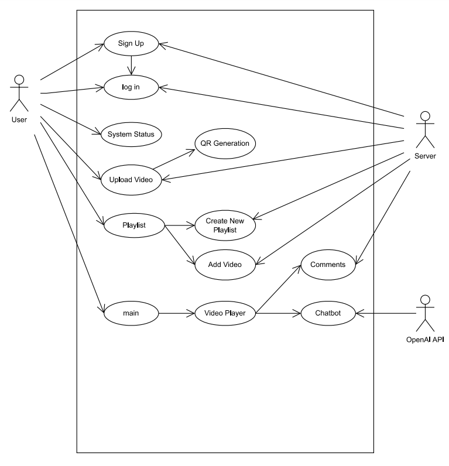

# Media Web Application Backend의 시청 서비스 Use Case 상세 기술서

## Use Case 다이어그램

## 1. 회원가입 (Sign Up)
**ID** | **Description**  
--- | ---  
유스케이스명 | 회원가입(Sign Up)  
액터명 | 사용자  
개요 | 사용자가 시스템에 접속하여 회원가입을 진행한다.  
사전조건 | <li> 시스템의 네트워크 연결이 정상적이어야 한다.</li>  
사후조건 | <li> 사용자는 회원가입을 완료하고 계정을 생성한다.</li>  
기본흐름 | <li> 사용자가 시스템에 접속한다.</li><li> 사용자가 회원가입 양식을 작성하고 제출한다.</li><li> Frontend는 Backend에 회원가입 정보를 요청한다.</li><li> Backend는 회원 정보를 저장하고 성공 여부를 응답한다.</li><li> Frontend는 사용자에게 회원가입 성공 메시지를 제공한다.</li>  
대체흐름 | <li> 회원가입 실패 시, 시스템은 사용자에게 오류 메시지를 제공한다.</li>  

---

## 2. 로그인 (Log In)
**ID** | **Description**  
--- | ---  
유스케이스명 | 로그인(Log In)  
액터명 | 사용자  
개요 | 사용자가 시스템에 접속하여 계정으로 로그인을 진행한다.  
사전조건 | <li> 네트워크 연결이 정상적이어야 한다.</li>  
사후조건 | <li> 사용자는 시스템에 로그인하여 접근 권한을 획득한다.</li>  
기본흐름 | <li> 사용자가 로그인 화면에서 계정 정보를 입력하고 제출한다.</li><li> Frontend는 Backend에 로그인 인증을 요청한다.</li><li> Backend는 데이터베이스에서 계정 정보를 확인한다.</li><li> 인증이 성공하면 Frontend는 로그인 완료 메시지를 제공한다.</li>  
대체흐름 | <li> 계정 정보가 잘못된 경우, 시스템은 로그인 실패 메시지를 제공한다.</li>  

---

## 3. 동영상 업로드 (Upload Video)
**ID** | **Description**  
--- | ---  
유스케이스명 | 동영상 업로드(Upload Video)  
액터명 | 사용자  
개요 | 사용자가 동영상 파일을 업로드하여 서버에 저장한다.  
사전조건 | <li> 사용자 계정이 로그인되어 있어야 한다.</li>  
사후조건 | <li> 동영상 파일이 서버에 성공적으로 저장된다.</li>  
기본흐름 | <li> 사용자가 동영상 업로드 메뉴로 이동한다.</li><li> 사용자는 QR생성 버튼을 클릭해 QR코드로 영상 업로드 사이트로 들어간다.</li><li>사용자는 업로드할 동영상 파일을 선택하고 제출한다.</li><li> Frontend는 Backend로 파일 업로드 요청을 전송한다.</li><li> Backend는 파일을 저장하고 성공 여부를 반환한다.</li><li> 사용자는 업로드 완료 메시지를 확인한다.</li>  
대체흐름 | <li> 업로드 실패 시, 시스템은 사용자에게 오류 메시지를 제공한다.</li>  

---

## 4. 댓글 추가 (Comments)
**ID** | **Description**  
--- | ---  
유스케이스명 | 댓글 추가(Comments)  
액터명 | 사용자  
개요 | 사용자가 동영상에 댓글을 작성하고 추가한다.  
사전조건 | <li> 네트워크 연결과 사용자 로그인이 필요하다.</li>  
사후조건 | <li> 댓글이 해당 동영상에 성공적으로 추가된다.</li>  
기본흐름 | <li> 사용자가 동영상 플레이어 화면에서 댓글 입력 창에 내용을 작성한다.</li><li> 사용자가 댓글 작성 버튼을 클릭한다.</li><li> Frontend는 Backend에 댓글 추가 요청을 보낸다.</li> <li> Backend는 댓글을 데이터베이스에 저장하고 성공 여부를 반환한다.</li><li> Frontend는 댓글이 성공적으로 추가된 것을 화면에 표시한다.</li>  
대체흐름 | <li> 댓글 작성 실패 시, 오류 메시지를 사용자에게 표시한다.</li>  

---

## 5. 플레이리스트 관리 (Playlist)
**ID** | **Description**  
--- | ---  
유스케이스명 | 플레이리스트 관리(Create New Playlist, Add Video)  
액터명 | 사용자  
개요 | 사용자가 새 플레이리스트를 만들고 동영상을 추가한다.  
사전조건 | <li> 사용자 계정이 로그인된 상태여야 한다.</li>  
사후조건 | <li> 새 플레이리스트가 생성되고 동영상이 추가된다.</li>  
기본흐름 | <li> 사용자가 플레이리스트 메뉴로 이동한다.</li><li> 새 플레이리스트를 생성한다.</li><li> Frontend는 Backend에 저장 요청을 보낸다.</li><li> Backend는 데이터를 저장하고 성공 여부를 반환한다.</li><li> 사용자가 동영상을 선택하고 플레이리스트에 추가한다.</li><li> Frontend는 Backend에 저장 요청을 보낸다.</li><li> Backend는 데이터를 저장하고 성공 여부를 반환한다.</li>  
대체흐름 | <li> 플레이리스트 생성 또는 영상 추가 실패 시 오류 메시지를 표시한다.</li>  

---

## 6. 챗봇 사용 (Chatbot)
**ID** | **Description**  
--- | ---  
유스케이스명 | 챗봇 사용(Chatbot)  
액터명 | 사용자  
개요 | 사용자가 챗봇과 상호작용하여 도움을 받는다.  
사전조건 | <li> 시스템과 OpenAI API의 연결이 정상적이어야 한다.</li>  
사후조건 | <li> 사용자는 챗봇으로부터 질문에 대한 답변을 제공받는다.</li>  
기본흐름 | <li> 사용자가 시스템 내 챗봇 메뉴로 이동한다.</li><li> 사용자가 챗봇에 질문을 입력한다.</li><li> Frontend는 OpenAI API에 요청하고 답변을 가져온다.</li><li> Frontend는 사용자에게 챗봇의 답변을 표시한다.</li>  
대체흐름 | <li> OpenAI API 오류 시, 사용자에게 연결 실패 메시지를 표시한다.</li>  
